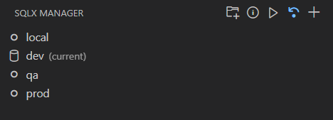
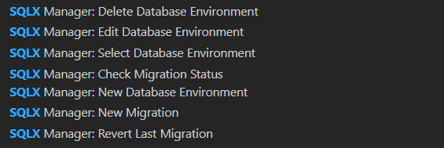

# SQLX Migration Manager README

## Features

Run SQLX Commands against a database. Switch between databases.

Commands

## Requirements

[Rust](https://www.rust-lang.org/tools/install) and [SQLX CLI](https://github.com/launchbadge/sqlx/tree/main/sqlx-cli)

## Known Issues

No Tests :(

## Release Notes

See [CHANGELOG.md](CHANGELOG.md)

## Development

Generated by running `npx -p yo -p generator-code yo code`.

Developed initially with Claude 3.7.

[VsCode Extension Quickstart](vsc-extension-quickstart.md) might be helpful.

### Running the project

Install dependencies `npm install`.

Start the extension in a test window `f5`.

### Formatting and Linting

Prettier, Lint-Staged, and Husky are set up to format and lint the code on commit. To manually run the formatter, run `npx prettier --write .`

### Recommended testing

First, launch the extension. Then, add the project folder to the new window's workspace so we can run the test migrations.

To test running migrations against a "real" database, create a sqlite database at the root path by creating a file named `test.sqlite`.

Create a new environment pointing to `sqlite://./test.sqlite` (the created file) and test any of the commands.

### Packaging the extension

To package the extension for use in VsCode, run `vsce package`. Vsce will need to be installed globally `npm install -g @vscode/vsce`.
